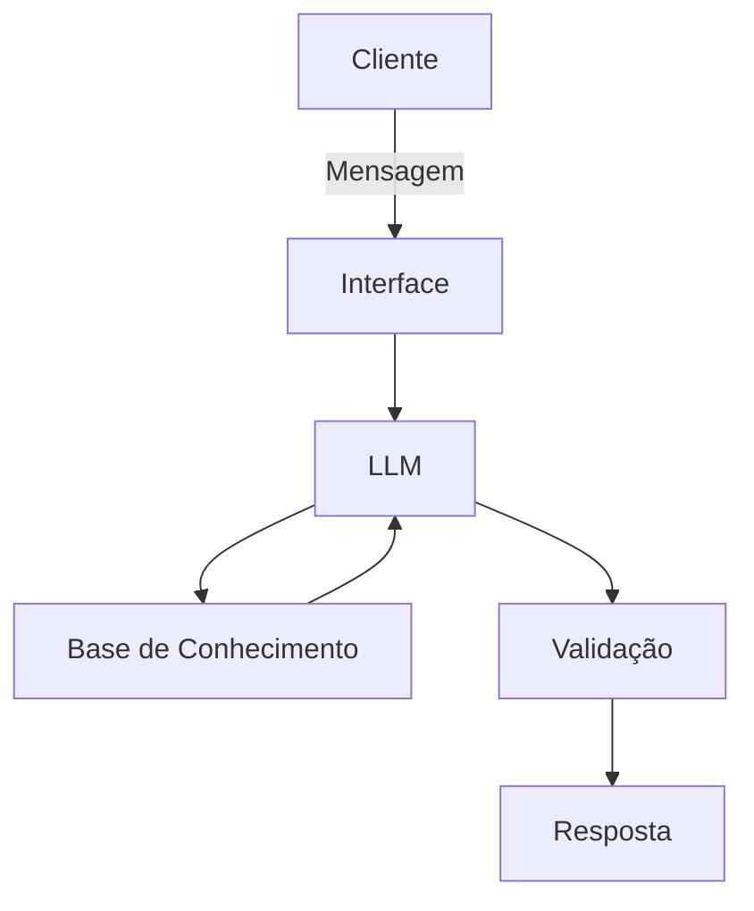

# Documentação do Agente

## Caso de Uso

### Problema
> Qual problema financeiro seu agente resolve?

[Gestão ineficiente do orçamento pessoal, causada pela falta de monitoramento e análise financeira.]

### Solução
> Como o agente resolve esse problema de forma proativa?

[O projeto aborda o problema da gestão ineficiente do orçamento pessoal, causada pela falta de monitoramento e análise estruturada das finanças, o que pode resultar em gastos desorganizados, atrasos em pagamentos e risco de endividamento.]

### Público-Alvo
> Quem vai usar esse agente?

[Usuários com baixo conhecimento em educação financeira]

---

## Persona e Tom de Voz

### Nome do Agente
[Lumi – Agente Financeiro Inteligente]

### Personalidade
> Como o agente se comporta? (ex: consultivo, direto, educativo)

[Consultiva, educativa e confiável]

### Tom de Comunicação
> Formal, informal, técnico, acessível?

[Acessível, claro e profissional]

### Exemplos de Linguagem
- Saudação: [ex: "Olá! Como posso ajudar com suas finanças hoje?"]
- Confirmação: [ex: "Entendi! Deixa eu verificar isso para você."]
- Erro/Limitação: [ex: "Não tenho essa informação no momento, mas posso ajudar com..."]

---

## Arquitetura

### Diagrama

### Componentes

| Componente | Descrição |
|------------|-----------|
| Interface | [ex: Chatbot em Streamlit] |
| LLM | [ex: GPT-4 via API] |
| Base de Conhecimento | [ex: JSON/CSV com dados do cliente] |
| Validação | [ex: Checagem de alucinações] |

---

## Segurança e Anti-Alucinação

### Estratégias Adotadas

- [ ] [ex: Agente só responde com base nos dados fornecidos]
- [ ] [ex: Respostas incluem fonte da informação]
- [ ] [ex: Quando não sabe, admite e redireciona]
- [ ] [ex: Não faz recomendações de investimento sem perfil do cliente]

### Limitações Declaradas
> O que o agente NÃO faz?

[O agente não substitui a orientação de um profissional financeiro, atuando apenas como suporte informativo.

O agente depende da qualidade e disponibilidade dos dados fornecidos para gerar análises e recomendações.

O agente não possui acesso direto a contas bancárias reais, operando apenas com dados simulados ou informados pelo usuário.

O agente não toma decisões financeiras de forma autônoma, cabendo ao usuário a decisão final.
